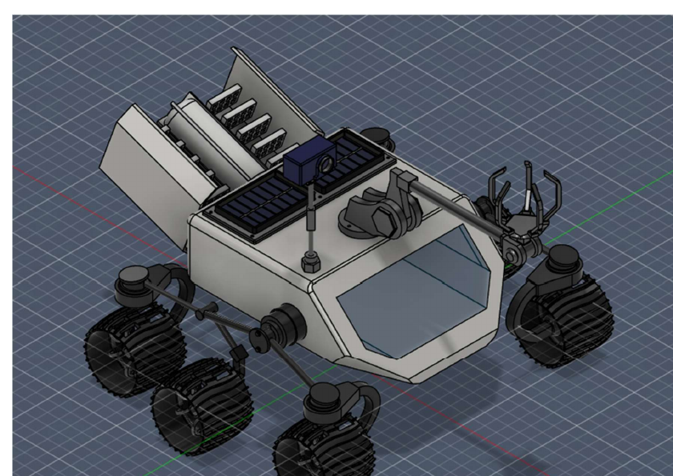
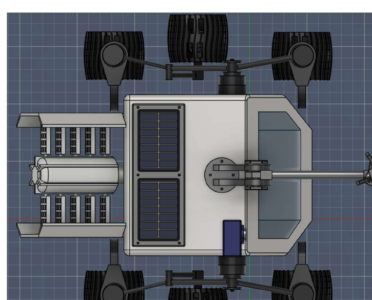
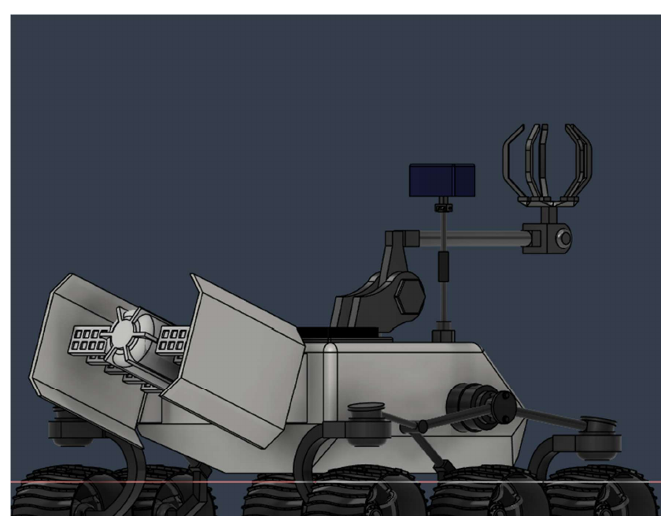

# MEC 203 Mars Integrity Rover

The Mars Integrity Rover was developed for MEC 203 as a sister-rover concept inspired by NASA’s Mars 2020 Perseverance mission. The project focused on maintaining the reliability of a proven six-wheel rover platform while developing a new sample-collection system capable of securely handling objects with irregular geometry.

## Project Walkthrough

**▶ [WATCH THE FULL MARS ROVER WALKTHROUGH](https://youtu.be/tB9zMO3_qDc)**

The design process included developing the rover chassis, suspension system, robotic arm, gripper mechanism, camera system, and supporting components as a complete CAD assembly. The project also considered mechanical fit, clearances, component placement, and overall rover functionality rather than treating the model as only a visual concept.

The design process included developing the rover chassis, suspension system, robotic arm, gripper mechanism, camera system, and supporting components as a complete CAD assembly. The project also considered mechanical fit, clearances, component placement, and overall rover functionality rather than treating the model as only a visual concept.

A major part of the project involved improving the sample-handling system. The final design used a multi-point gripper intended to provide greater stability and contact with collected objects while reducing the chance of slipping during sample collection. The robotic arm was designed with multiple pivot points to improve positioning and reach.

The rover chassis was designed around the suspension system to allow the wheels and rocker-bogie style mechanism to move through uneven terrain without interfering with the body. The final assembly also incorporated the camera system, solar panels, power system, and other supporting components into a complete rover layout.

The camera system was designed to rotate and tilt to provide visibility around the rover and surrounding terrain. The rear of the rover also incorporated the power system and protective structures while maintaining clearance from the ground and surrounding components.

The completed project includes the final rover assembly, individual CAD components, and the engineering report documenting the design process, component development, and final rover concept.

## Project Files

The repository includes the full MEC 203 project report as a PDF along with a compressed archive containing the CAD files used to create the rover assembly and its individual components.

## Project Images

